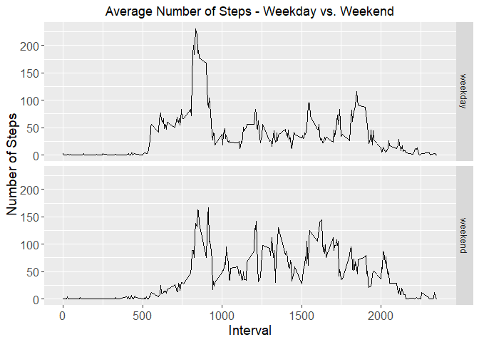

## Introduction

It is now possible to collect a large amount of data about personal movement using activity monitoring devices such as a Fitbit, Nike Fuelband, or Jawbone Up. These type of devices are part of the "quantified self" movement - a group of enthusiasts who take measurements about themselves regularly to improve their health, to find patterns in their behavior, or because they are tech geeks. But these data remain under-utilized both because the raw data are hard to obtain and there is a lack of statistical methods and software for processing and interpreting the data.

This assignment makes use of data from a personal activity monitoring device. This device collects data at 5 minute intervals through out the day. The data consists of two months of data from an anonymous individual collected during the months of October and November, 2012 and include the number of steps taken in 5 minute intervals each day.

The data for this assignment can be downloaded from the course web site:

Dataset: Activity monitoring data [52K]
The variables included in this dataset are:

steps: Number of steps taking in a 5-minute interval (missing values are coded as NA)
date: The date on which the measurement was taken in YYYY-MM-DD format
interval: Identifier for the 5-minute interval in which measurement was taken
The dataset is stored in a comma-separated-value (CSV) file and there are a total of 17,568 observations in this dataset.


```r
#Load Libraries
library(ggplot2)
```

```
## Warning: package 'ggplot2' was built under R version 3.5.3
```

```r
library(dplyr)
```

```
## 
## Attaching package: 'dplyr'
```

```
## The following objects are masked from 'package:stats':
## 
##     filter, lag
```

```
## The following objects are masked from 'package:base':
## 
##     intersect, setdiff, setequal, union
```
## Loading and preprocessing the data.

Downloand & unzip file for processing. Read and load CSV file into a Data Frame. 


```r
if(!file.exists("./data")){dir.create("./data")}
fileUrl <- "https://d396qusza40orc.cloudfront.net/repdata%2Fdata%2Factivity.zip"
download.file(fileUrl,destfile="./data/activity.zip",method="curl")

unzip(zipfile="./data/activity.zip",exdir="./data")
activity <- read.csv("./data/activity.csv")
activity$date <- as.Date(activity$date)
```

## What is mean total number of steps taken per day?

To answer this question 'na.rm=TRUE' is used to ignore the missing values in the dataset. Detail containing NA values will be excluded for the first part of the assignment. 

1. Calculate the total number of steps taken per day.

(For readability, only 'steps taken' for first 10 days are displayed)

```r
stepsPerDay <- activity %>%
        group_by(date) %>%
        summarize(sumsteps = sum(steps, na.rm = TRUE)) 
#Display first 10 rows of data
head(stepsPerDay,10)
```

```
## # A tibble: 10 x 2
##    date       sumsteps
##    <date>        <int>
##  1 2012-10-01        0
##  2 2012-10-02      126
##  3 2012-10-03    11352
##  4 2012-10-04    12116
##  5 2012-10-05    13294
##  6 2012-10-06    15420
##  7 2012-10-07    11015
##  8 2012-10-08        0
##  9 2012-10-09    12811
## 10 2012-10-10     9900
```

2. Make a histogram of the total number of steps taken each day.

```r
hist(stepsPerDay$sumsteps, main = "Histogram of Daily Steps", 
     col="blue", xlab="Steps", ylim = c(0,30))
```

<!-- -->

3. Calculate and report the mean and median of the total number of steps taken per day.

```r
meanPreNA <- round(mean(stepsPerDay$sumsteps),digits = 2)
medianPreNA <- round(median(stepsPerDay$sumsteps),digits = 2)

print(paste("The mean is: ", meanPreNA))
```

```
## [1] "The mean is:  9354.23"
```

```r
print(paste("The median is: ", medianPreNA))
```

```
## [1] "The median is:  10395"
```

## What is the average daily activity pattern?
1. Make a time series plot (i.e. type = "l"|) of the 5-minute interval (x-axis) and the average number of steps taken, averaged across all days (y-axis).


```r
stepsPerInterval <- activity %>%
        group_by(interval) %>%
        summarize(meansteps = mean(steps, na.rm = TRUE)) 
#Display first 10 rows of data
head(stepsPerInterval,10)
```

```
## # A tibble: 10 x 2
##    interval meansteps
##       <int>     <dbl>
##  1        0    1.72  
##  2        5    0.340 
##  3       10    0.132 
##  4       15    0.151 
##  5       20    0.0755
##  6       25    2.09  
##  7       30    0.528 
##  8       35    0.868 
##  9       40    0     
## 10       45    1.47
```

```r
plot(stepsPerInterval$meansteps ~ stepsPerInterval$interval,
     col="blue", type="l", xlab = "5 Minute Intervals", ylab = "Average Number of Steps",
     main = "Steps By Time Interval")
```

<!-- -->

2. Which 5-minute interval, on average across all the days in the dataset, contains the maximum number of steps?


```r
print(paste("Interval containing the most steps on average: ",stepsPerInterval$interval[which.max(stepsPerInterval$meansteps)]))
```

```
## [1] "Interval containing the most steps on average:  835"
```

```r
print(paste("Average steps for that interval: ",round(max(stepsPerInterval$meansteps),digits=2)))
```

```
## [1] "Average steps for that interval:  206.17"
```

## Imputing missing values
1. Calculate and report the total number of missing values in the dataset (i.e. the total number of rows with NAs)


```r
print(paste("The total number of rows with NA is: ",sum(is.na(activity$steps))))
```

```
## [1] "The total number of rows with NA is:  2304"
```
2. Devise a strategy for filling in all of the missing values in the dataset. The strategy does not need to be sophisticated. For example, you could use the mean/median for that day, or the mean for that 5-minute interval, etc.

NA Strategy - To solve for the missing NA values the average for the associated interval will be used. The average was built in a prior step and is readily available: First, loop through all records of a copy of the 'activity' data. Then, look for records containing NA values. Finally, transform the 'steps' value based on matching the interval in the 'stepsPerInterval' data frame created in a prior step.


3. Create a new dataset that is equal to the original dataset but with the missing data filled in.

```r
#Before 
#Display first 10 rows of data
head(activity,10)
```

```
##    steps       date interval
## 1     NA 2012-10-01        0
## 2     NA 2012-10-01        5
## 3     NA 2012-10-01       10
## 4     NA 2012-10-01       15
## 5     NA 2012-10-01       20
## 6     NA 2012-10-01       25
## 7     NA 2012-10-01       30
## 8     NA 2012-10-01       35
## 9     NA 2012-10-01       40
## 10    NA 2012-10-01       45
```

```r
activityNoNA <- activity  
for (i in 1:nrow(activity)){
        if(is.na(activity$steps[i])){
                activityNoNA$steps[i]<- stepsPerInterval$meansteps[activityNoNA$interval[i] == stepsPerInterval$interval]
        }
}

#After
#Display first 10 rows of data
head(activityNoNA,10)
```

```
##        steps       date interval
## 1  1.7169811 2012-10-01        0
## 2  0.3396226 2012-10-01        5
## 3  0.1320755 2012-10-01       10
## 4  0.1509434 2012-10-01       15
## 5  0.0754717 2012-10-01       20
## 6  2.0943396 2012-10-01       25
## 7  0.5283019 2012-10-01       30
## 8  0.8679245 2012-10-01       35
## 9  0.0000000 2012-10-01       40
## 10 1.4716981 2012-10-01       45
```
4. Make a histogram of the total number of steps taken each day and Calculate and report the mean and median total number of steps taken per day. Do these values differ from the estimates from the first part of the assignment? What is the impact of imputing missing data on the estimates of the total daily number of steps?


```r
stepsPerDay <- activityNoNA %>%
        group_by(date) %>%
        summarize(sumsteps = sum(steps, na.rm = TRUE)) 
head(stepsPerDay,10)
```

```
## # A tibble: 10 x 2
##    date       sumsteps
##    <date>        <dbl>
##  1 2012-10-01   10766.
##  2 2012-10-02     126 
##  3 2012-10-03   11352 
##  4 2012-10-04   12116 
##  5 2012-10-05   13294 
##  6 2012-10-06   15420 
##  7 2012-10-07   11015 
##  8 2012-10-08   10766.
##  9 2012-10-09   12811 
## 10 2012-10-10    9900
```

```r
hist(stepsPerDay$sumsteps, main = "Histogram of Daily Steps", 
     col="blue", xlab="Steps")
```

<!-- -->

```r
meanPostNA <- round(mean(stepsPerDay$sumsteps), digits = 2)
medianPostNA <- round(median(stepsPerDay$sumsteps), digits = 2)

print(paste("The mean is: ", mean(meanPostNA)))
```

```
## [1] "The mean is:  10766.19"
```

```r
print(paste("The median is: ", median(medianPostNA)))
```

```
## [1] "The median is:  10766.19"
```

Once logic is applied to imput missing values it allows for all detail records to be included increasing both the mean and median. The mean increases from 9354.23 to 10766.19. It is important to note that NA values in the first part of the project were ignored (na.rm = TRUE). Once averages were applied to the missing values the overall mean increased.  

```r
NACompare <- data.frame(mean = c(meanPreNA,meanPostNA),median = c(medianPreNA,medianPostNA))
rownames(NACompare) <- c("Pre NA Transformation", "Post NA Transformation")
print(NACompare)
```

```
##                            mean   median
## Pre NA Transformation   9354.23 10395.00
## Post NA Transformation 10766.19 10766.19
```


## Are there differences in activity patterns between weekdays and weekends?
1. Create a new factor variable in the dataset with two levels - "weekday" and "weekend" indicating whether a given date is a weekday or weekend day.


```r
activityDoW <- activityNoNA
activityDoW$date <- as.Date(activityDoW$date)
activityDoW$day <- ifelse(weekdays(activityDoW$date) %in% c("Saturday", "Sunday"), "weekend", "weekday")
activityDoW$day <- as.factor(activityDoW$day)
```
2. Make a panel plot containing a time series plot (i.e. type="l") of the 5-minute interval (x-axis) and the average number of steps taken, averaged across all weekday days or weekend days (y-axis).

```r
activityWeekday <- filter(activityDoW, activityDoW$day == "weekday")
activityWeekend <- filter(activityDoW, activityDoW$day == "weekend")

activityWeekday <- activityWeekday %>%
        group_by(interval) %>%
        summarize(steps = mean(steps)) 
activityWeekday$day <- "weekday"

activityWeekend <- activityWeekend %>%
        group_by(interval) %>%
        summarize(steps = mean(steps)) 
activityWeekend$day <- "weekend"

newInterval <- rbind(activityWeekday, activityWeekend)
newInterval$day <- as.factor(newInterval$day)


g <- ggplot (newInterval, aes (interval, steps))
g + geom_line() + facet_grid (day~.) + 
        theme(axis.text = element_text(size = 12),axis.title = element_text(size = 14)) + 
        labs(y = "Number of Steps") + labs(x = "Interval") + 
        ggtitle("Average Number of Steps - Weekday vs. Weekend") + 
        theme(plot.title = element_text(hjust = 0.5))
```

<!-- -->

